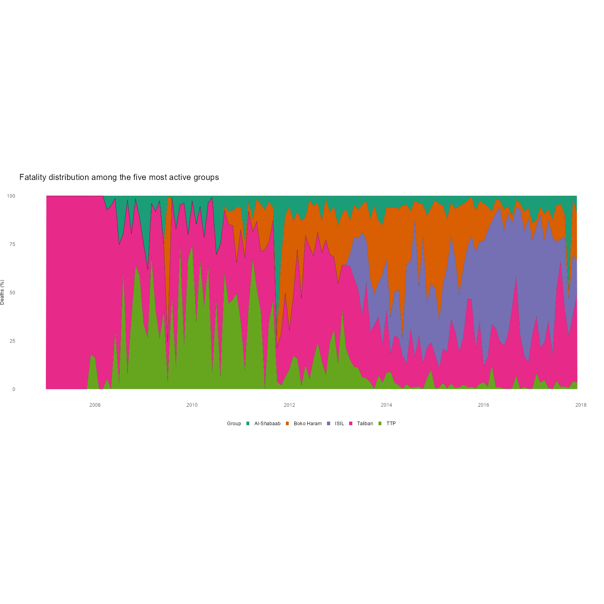

# Global Terrorism Data Analysis (2007–2017)

This project analyzes the **Global Terrorism Database** from 2007 to 2017 to understand trends in terrorist activity, fatalities, and group-level impact over time.

Using R and data visualization tools, we focus on:
- Identifying the most active terrorist groups
- Tracking fatalities over time
- Visualizing each group's relative contribution to total deaths
- Creating publication-quality plots

---

## 📊 Project Highlights

- **Dataset**: [Global Terrorism Database (GTD)]
- **Time Period**: 2007–2017
- **Key Metrics**:
  - Number of attacks
  - Fatalities per month
  - Top 5 most active groups (by attack count)
  - Group-specific fatality share over time

### 📈 Visualization Example



---

## 📁 Files

| File | Description |
|------|-------------|
| `Global terrorism project.ipynb` | Main R notebook with data analysis and plotting |
| `globalterrorismdb_0718dist.csv` | GTD dataset (2007–2017) |
| `top_five_groups_percent_ts.png` | Plot showing % of deaths per month per top 5 groups |
| `.gitignore` | Optional: exclude large files or temporary data |

---

## 🚀 How to Run

### 1. Clone the Repository
```bash
git clone https://github.com/yourusername/global-terrorism-analysis.git
cd global-terrorism-analysis
```

### 2. Open the R Notebook

You can open the `.ipynb` file in:
- [RStudio](https://posit.co/download/rstudio/) (with R Notebooks support)
- [Jupyter with IRKernel](https://irkernel.github.io/installation/)

### 3. Install R Packages

Make sure you have the required packages:

```r
install.packages(c("dplyr", "tidyr", "ggplot2", "lubridate", "grid", "readr"))
```

---

## 🧠 Insights

- A few groups are responsible for a disproportionate share of fatalities.
- Deadliest months are often clustered around conflict zones and specific time periods.
- Fatality shares vary month-to-month, but major groups dominate long-term trends.

---

## 📜 License

This project is for educational and analytical purposes. The original dataset is provided by [START, University of Maryland](https://www.start.umd.edu/gtd/).

---

## ✍️ Author

Omkar Kendale
